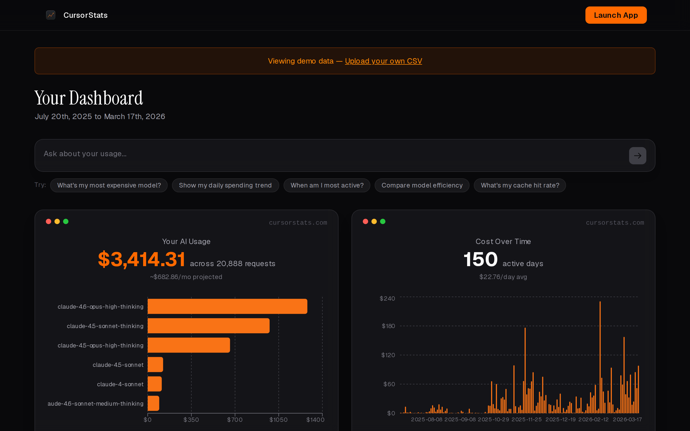

# CursorStats

Visualize your Cursor AI usage patterns. Upload your usage CSV, ask questions in natural language, get interactive charts.

[](https://cursorstats.vercel.app)

## Why CursorStats?

Cursor gives you a usage export, but it's just a CSV — a wall of rows that's nearly impossible to read. I kept wondering where my spend was actually going: which models cost the most, when I code the hardest, how much of my token usage was just cache reads. So I built CursorStats to turn that export into something I could actually *see*.

The twist is that you don't have to know what to chart. Ask a question in plain English — "what's my most expensive model?", "when am I most active?" — and it builds the chart for you. Your CSV is parsed entirely in your browser; only aggregated stats (never raw rows) are sent to the model to decide which chart to draw, so your usage data never leaves your machine.

## Features

- 📤 **Upload** — Drop your Cursor usage CSV export (parsed entirely in your browser)
- 💬 **Ask** — Natural language queries about your usage
- 📊 **Visualize** — Interactive, animated charts that answer your questions

## How to Export from Cursor

1. Go to Cursor **Settings** → **Usage**
2. Click **Export CSV**
3. Upload the file to CursorStats

## Tech Stack

- Next.js 16 (App Router)
- Tailwind CSS 4
- Recharts + Framer Motion
- Vercel AI SDK + Anthropic Claude

## Development

```bash
pnpm install
pnpm dev
```

The prompt → chart feature calls the Anthropic API. To use it locally, add your key to `.env.local`:

```bash
ANTHROPIC_API_KEY=sk-ant-...
```

The build itself (`pnpm build`) does not require any environment variables.

## License

MIT — see [LICENSE](LICENSE).
